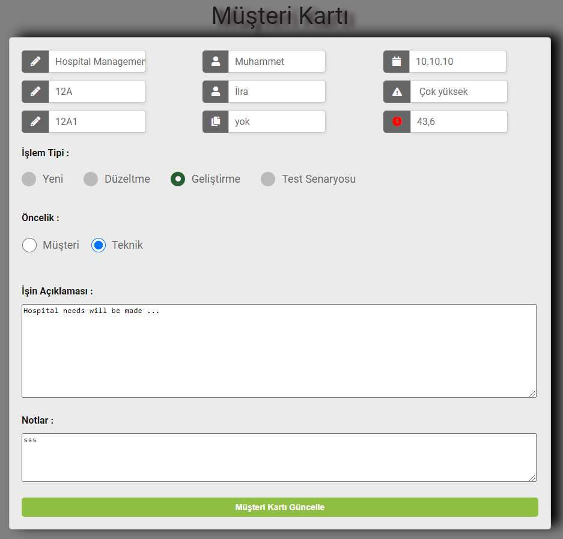
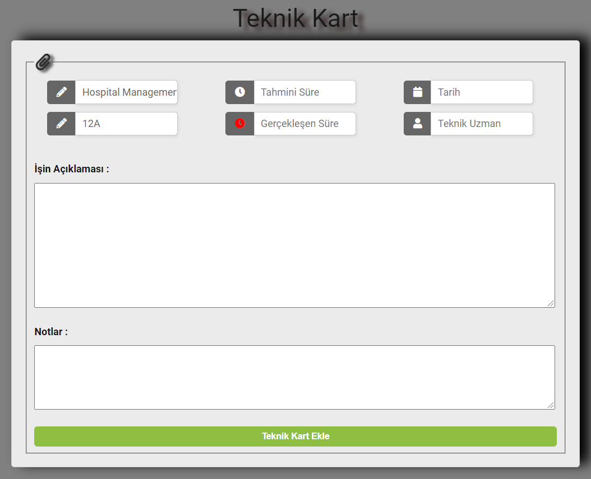
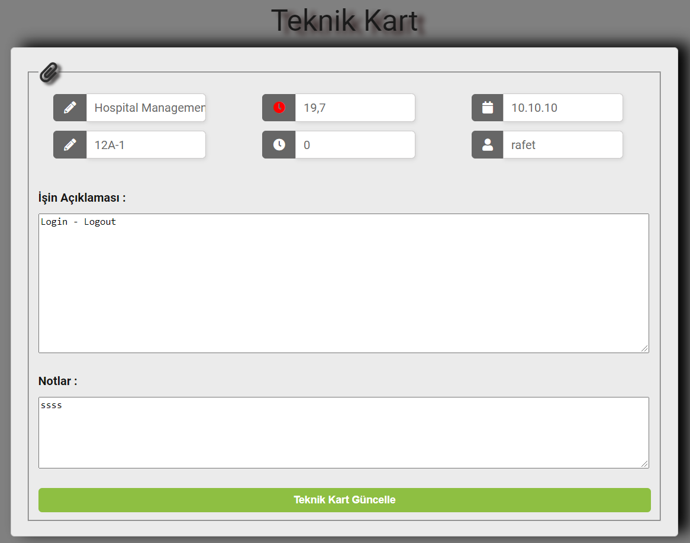
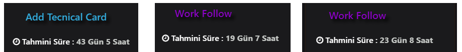

# .Net-Framework-TaskBoard
TaskBoard is a job tracking application.
 
 
<ul>
  <li>
    Müşteri Kartının Eklenmesi<strong>(Add Customer Card):</strong>

Yukarıdaki gif üzerinde görünen Customer Card bölümündeki artı butonuna tıklayınız ve aşağıda gördüğününüz müşteri kartı bilgilerini girerek ekle butonuna tıklayanız.
<strong>(Click the plus button in the Customer Card section that appears on the gif and enter the customer card information you see below and click the add button.)</strong>
</img>
  </li>
  <li>
  Müşteri kartının eklendikten sonraki görüntüsü aşağıdaki gibi olmalıdır.<strong>(Image after adding the customer card)</strong> 
</img>
  </li>
   <li>
  Müşteri Kartının Güncellenmesi<strong>(Update Customer Card):</strong>
Eklenen müşteri kartı kart üzerindeki güncelle(refresh) butonuna tıklanarak açılan aşağıdaki ekran üzerinden istenilen yerlerin değiştirilmesinden sonra güncelle butonuna tıklanarak işlem gerçekleştirilir.
<strong>(The update button is clicked. After changing the desired places on the screen below, the process is executed by clicking the update button.)</strong> 
</img>
  </li>
   <li>
  Müşteri Kartı Detay Görüntüleme<strong>(Detail Customer Card):</strong>
Eklenen müşteri kartı kart üzerindeki detay butonuna tıklanarak açılan  ekran üzerinden kart detayı görüntülenebilir.
<strong>(The card details can be viewed on the screen opened by clicking the detail button on the added customer card card.)</strong> 
  </li>
  <li>
Müşteri Kartının İş Takibi<strong>(business tracking of customer card):</strong>
Eklenen müşteri kartı kart üzerindeki iş takibi butonuna tıklanarak açılan aşağıdaki ekran üzerinden iş takibi eklemesi gerçekleştirilebilir. Ayrıca eklenen takip işlemleri ekran üzerinden görüntülenebilir.
<strong>(The job tracking button on the card is clicked. Job tracking can be added on the screen that opens. In addition, added tracking transactions can be viewed on the screen.)</strong>
  <li>
    Bu ekran üzerinden müşteri kartına ait teknik kartlar ve detayları görüntülenebilir.
    <strong>(Technical cards and details of the customer card can be viewed on this screen.)</strong> 
</img>
  </li>
</li>
<li>
  Yukarıdaki ekran üzerinden tamamlanan işler bitti butonuna tıklanarak belirtilebilir ya da sil butonuna tıklanarak silme işlemi yapılabilir.
<strong>(The completed jobs can be specified by clicking on the done button or they can be deleted by clicking the delete button.)</strong>
</li>
<li>
  Teknik Kart Ekleme<strong>(Add Technical Card):</strong>

Müşteri Kartı üzerinde bulunan Add Technical Card butonuna tıklanarak açılan aşağıdaki ekran üzerinden gerekli yerler doldurularak işlem gerçekleştirilir.
<strong>(The Add Technical Card button on the Customer Card is clicked. The process is carried out by filling the required places on the screen that opens.)</strong> 
</img>
</li>
<li>
  Teknik Kart Güncelleme<strong>(Update Technical Card):</strong>

Eklenen teknik kart üzerindeki güncelle(refresh) butonuna tıklanarak açılan aşağıdaki ekran üzerinden istenilen yerlerin değiştirilmesinden sonra güncelle butonuna tıklanarak işlem gerçekleştirilir.
<strong>(Click the update button on the added technical card. After changing the desired places on the screen that opens, the process is executed by clicking the update button.)</strong> 
</img>
</li>
<li>
<strong>Eklenen kartların en alt kısmında kartlara ait tahmini tamamlanma süresi gösterilmektedir.Bu süre tahmini ML.NET ile yapılmıştır.
(The estimated completion time of the cards is shown at the bottom of the added cards. Used ML.NET)</strong> 
</img>
</li>
</ul>
<strong>NOT : Ek olarak uygulamanın içeresinde 6 adet White box testi bulunmaktadır.
(NOTE: In addition, there are 6 White box tests in the application</strong>

