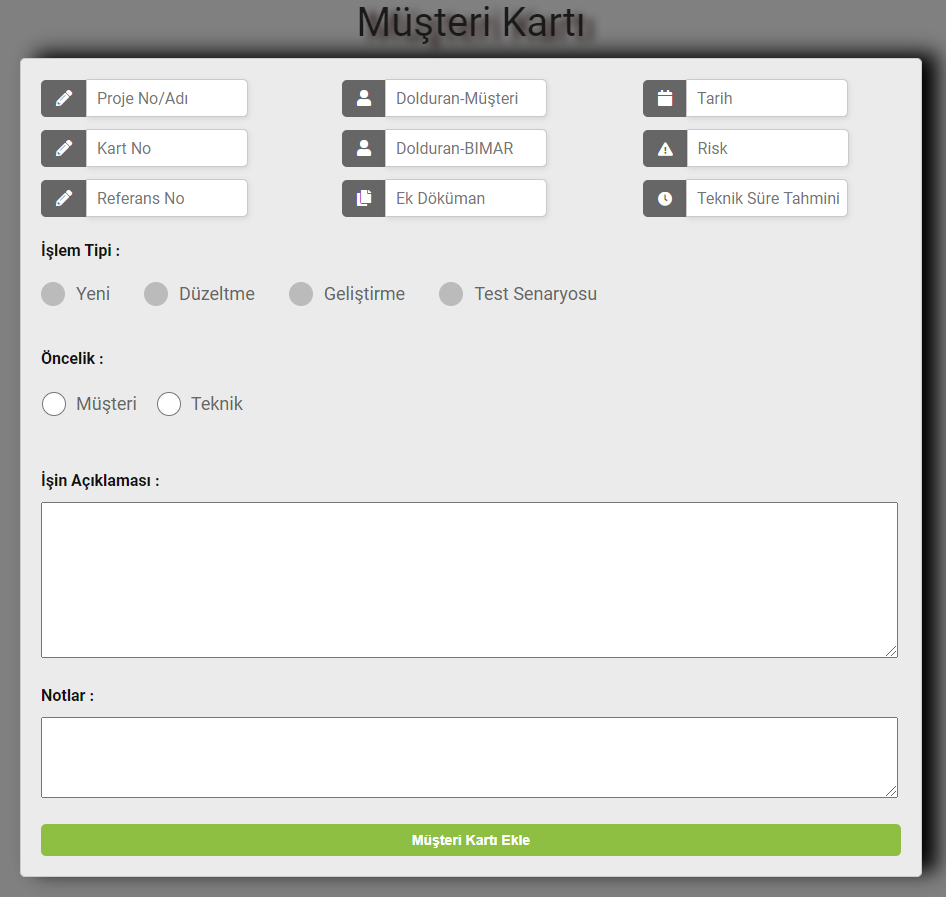
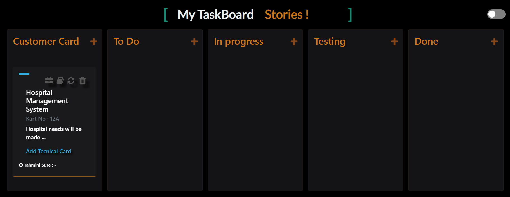

# .Net-Framework-TaskBoard
TaskBoard is a job tracking application.
 
 
<ul>
  <li>
    Müşteri Kartının Eklenmesi<strong>(Add Customer Card):</strong>

Yukarıdaki gif üzerinde görünen Customer Card bölümündeki artı butonuna tıklayınız ve aşağıda gördüğününüz müşteri kartı bilgilerini girerek ekle butonuna tıklayanız.
<strong>(Click the plus button in the Customer Card section that appears on the gif and enter the customer card information you see below and click the add button.)</strong>
 
  </li>
  <li>
  Müşteri kartının eklendikten sonraki görüntüsü aşağıdaki gibi olmalıdır.<strong>(Image after adding the customer card)</strong>
 
  </li>
</ul>
